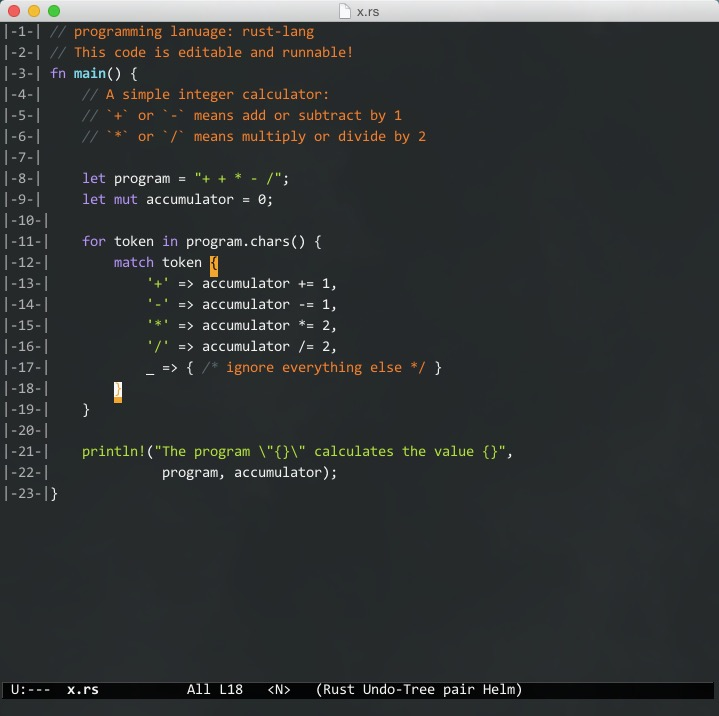

# color-theme-lime

## color-theme-lime ##

emacs 颜色纯净又炫酷的一种搭配方案

## preview ##



## 设置 ##

```
;;in .emacs
(defun load-molo-theme ()
  (interactive)
     (load "~/.emacs.d/elpa/color-theme-lime/lime-theme.el"))

(global-set-key "\C-cl" 'load-molo-theme)
```	 
